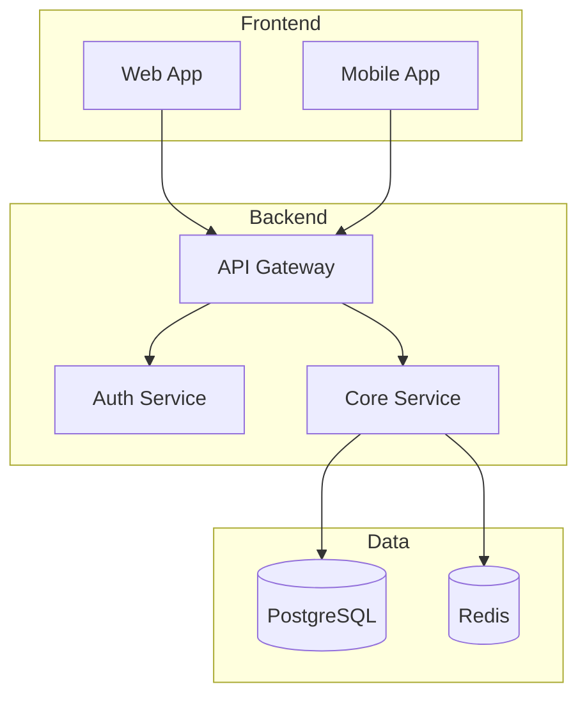

# Senior Architect

Complete toolkit for senior architect with modern tools and best practices.

## Core Capabilities

### 1. Architecture Diagram Generation

Create clear, maintainable architecture diagrams using Mermaid or ASCII art.

**C4 Model Levels:**
- **Context**: System and external actors
- **Container**: Applications, databases, services
- **Component**: Internal structure of containers
- **Code**: Class/module level (rarely needed)

**Mermaid Example:**


### 2. System Design Workflow

**Step 1: Requirements Gathering**
- Functional requirements (what it does)
- Non-functional requirements (performance, scale, reliability)
- Constraints (budget, timeline, existing systems)

**Step 2: High-Level Design**
- Identify major components
- Define data flow
- Choose communication patterns (sync/async, REST/GraphQL/gRPC)

**Step 3: Detailed Design**
- Database schema
- API contracts
- Error handling strategy
- Caching strategy

**Step 4: Trade-off Analysis**
- Document alternatives considered
- Explain why chosen approach wins
- Note risks and mitigations

### 3. Dependency Analysis

Analyze project dependencies to understand:
- Direct vs transitive dependencies
- Security vulnerabilities
- Outdated packages
- License compliance

**Commands:**
```bash
# Node.js
npm ls --all
npm audit
npm outdated

# Python
pip list --outdated
pip-audit
pipdeptree

# Go
go mod graph
go list -m -u all
```

## Architecture Patterns

### Monolith

**When to use:**
- Early-stage products
- Small teams (< 10 developers)
- Simple domain

**Structure:**
```
src/
├── api/          # HTTP handlers
├── domain/       # Business logic
├── repository/   # Data access
└── infrastructure/ # External services
```

### Microservices

**When to use:**
- Independent scaling requirements
- Multiple teams with clear boundaries
- Polyglot requirements

**Key concerns:**
- Service discovery
- Distributed tracing
- Data consistency (eventual vs strong)
- API versioning

### Event-Driven

**When to use:**
- Loose coupling between services
- Async processing requirements
- Audit trail needs

**Patterns:**
- Event sourcing
- CQRS (Command Query Responsibility Segregation)
- Saga pattern for distributed transactions

## Tech Stack Decision Framework

### Database Selection

| Need | Choose |
|------|--------|
| Relational data, ACID | PostgreSQL |
| Document flexibility | MongoDB |
| High-speed caching | Redis |
| Time-series data | TimescaleDB, InfluxDB |
| Full-text search | Elasticsearch, Meilisearch |
| Graph relationships | Neo4j, DGraph |

### API Style Selection

| Need | Choose |
|------|--------|
| Simple CRUD, broad compatibility | REST |
| Complex queries, frontend flexibility | GraphQL |
| High performance, binary protocol | gRPC |
| Real-time bidirectional | WebSocket |

### Frontend Framework Selection

| Need | Choose |
|------|--------|
| SEO, SSR, full-stack | Next.js |
| SPA, client-heavy | React + Vite |
| Mobile apps | React Native, Flutter |
| Simple sites | Astro, 11ty |

## Design Principles

### SOLID for Architecture

- **Single Responsibility**: Each service does one thing well
- **Open/Closed**: Extend via configuration, not modification
- **Liskov Substitution**: Services honor their contracts
- **Interface Segregation**: Small, focused APIs
- **Dependency Inversion**: Depend on abstractions

### 12-Factor App

1. **Codebase**: One repo per service
2. **Dependencies**: Explicitly declared
3. **Config**: Environment variables
4. **Backing services**: Treat as attached resources
5. **Build, release, run**: Strict separation
6. **Processes**: Stateless, share-nothing
7. **Port binding**: Self-contained HTTP server
8. **Concurrency**: Scale via processes
9. **Disposability**: Fast startup, graceful shutdown
10. **Dev/prod parity**: Keep environments similar
11. **Logs**: Treat as event streams
12. **Admin processes**: Run as one-off tasks

## Common Anti-Patterns

### Distributed Monolith
- **Symptom**: Services tightly coupled, deploy together
- **Fix**: Define clear boundaries, async communication

### Big Ball of Mud
- **Symptom**: No clear structure, everything depends on everything
- **Fix**: Introduce layers, enforce boundaries

### Golden Hammer
- **Symptom**: Using one tool for everything
- **Fix**: Choose tools based on requirements

### Premature Optimization
- **Symptom**: Complex architecture for simple problems
- **Fix**: Start simple, evolve based on real needs

## Performance Considerations

### Caching Strategy

**Cache Locations:**
- Browser (HTTP cache headers)
- CDN (static assets, API responses)
- Application (Redis, in-memory)
- Database (query cache)

**Cache Invalidation:**
- Time-based (TTL)
- Event-based (pub/sub)
- Write-through vs write-behind

### Database Optimization

**Indexing:**
- Index columns used in WHERE, JOIN, ORDER BY
- Composite indexes for multi-column queries
- Avoid over-indexing (slows writes)

**Query Optimization:**
- Use EXPLAIN ANALYZE
- Avoid N+1 queries
- Use connection pooling

### Scaling Patterns

**Vertical**: Bigger machines (easy but limited)
**Horizontal**: More machines (complex but scalable)

**Read scaling**: Read replicas, caching
**Write scaling**: Sharding, partitioning

## Security Checklist

### Authentication
- [ ] Use proven libraries (passport, next-auth, better-auth)
- [ ] Secure session management
- [ ] MFA for sensitive operations

### Authorization
- [ ] RBAC or ABAC implementation
- [ ] Principle of least privilege
- [ ] API key rotation

### Data Protection
- [ ] Encrypt at rest and in transit
- [ ] PII handling compliant
- [ ] Audit logging

### Infrastructure
- [ ] Network segmentation
- [ ] Secrets management (Vault, AWS Secrets Manager)
- [ ] Regular security scanning

## Documentation Templates

### Architecture Decision Record (ADR)

```markdown
# ADR-001: Choose PostgreSQL for primary database

## Status
Accepted

## Context
We need a primary database for user data and transactions.

## Decision
Use PostgreSQL with Prisma ORM.

## Consequences
- Pro: Strong consistency, mature ecosystem
- Pro: JSON support for flexible schemas
- Con: Horizontal scaling requires more effort
```

### API Contract

```yaml
openapi: 3.0.0
info:
  title: User Service
  version: 1.0.0
paths:
  /users/{id}:
    get:
      summary: Get user by ID
      parameters:
        - name: id
          in: path
          required: true
          schema:
            type: string
      responses:
        200:
          description: User found
        404:
          description: User not found
```

## Quick Commands

```bash
# Development
npm run dev
npm run build
npm run test
npm run lint

# Analysis
npx depcheck              # Find unused dependencies
npx madge --circular src  # Find circular dependencies
npx bundle-size           # Analyze bundle size

# Deployment
docker build -t app:latest .
docker-compose up -d
kubectl apply -f k8s/
```
